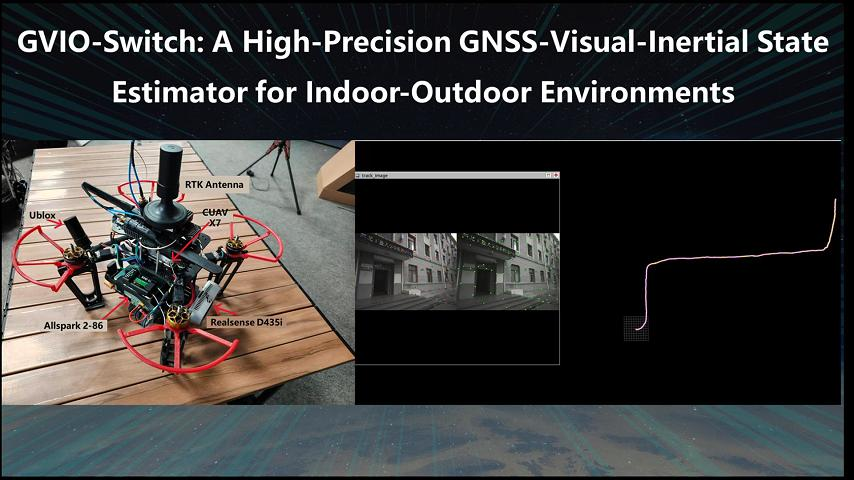
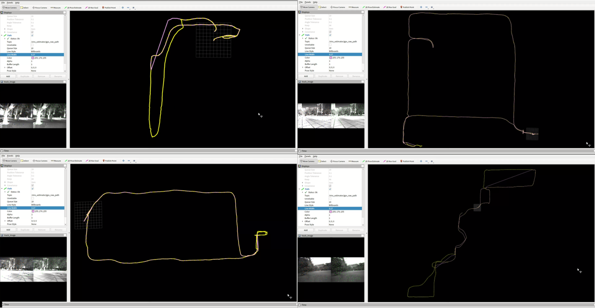
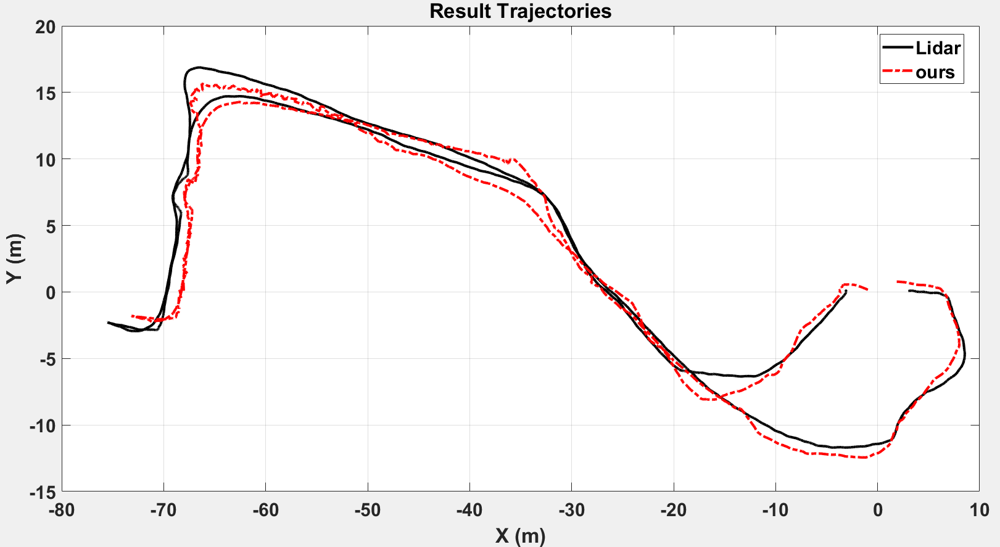

# GVI-Switch
## GVI-Switch: A High-Precision GNSS-Visual-Inertial State Estimator for Indoor-Outdoor Environments
We propose a high-precision GNSS-visual-inertial state estimator named GVI-Switch, augmented by a loosely coupled Error State Kalman Filter (ESKF), to achieve accurate and stable six-degree-of-freedom (6-DoF) pose estimation during GNSS signal degradation. First, we developed a GNSS degradation detection scheme based on commonly observed GNSS degradation phenomena. This scheme effectively identifies and eliminates abnormal GNSS signals. During the joint initialization phase, we account for the noise amplification in GNSS signals caused by the carrier's passive movement and propose a method to detect and exclude signals that are severely affected by noise. In the loosely coupled ESKF process, to handle GNSS signal fluctuations during transitions between indoor and outdoor environments, we designed a feedback buffering mechanism that constrains the error state vector. This mechanism not only mitigates the accumulation of errors in a degenerate system but also ensures the stability of positioning results during GNSS status changes. Experimental results from both practical flight tests and our proposed dataset, which includes challenging scenarios of transitioning between indoor and outdoor environments, demonstrate that our algorithm achieves high-precision, stable, and continuous global positioning, with an Absolute Trajectory Error (ATE) reduction of up to 70\% compared to state-of-the-art (SoTA) GNSS fusion algorithms.

Click for the video demo.
[]((https://youtu.be/kl__fbxK6TY))
## 1.Datasets
We collected seven sequences, comprising three indoor and four outdoor scenes. These sequences included challenging visual scenarios. such as featureless environments, frequent occlusions, abrupt lighting changes, overexposure, dynamic objects, and large-scale scenes. For indoor sequences, we utilized a motion capture system to acquire ground truth poses with millimeter-level accuracy. For outdoor sequences, Real-Time Kinematic (RTK) technology was employed to obtain ground truth trajectories with centimeter-level precision.

### 1.1Topics
```cpp
Stereostopic: /camera/infra1/image_rect_raw 15Hz,
              /camera/infra2/image_rect_raw 15Hz
imu: /mavros/imu/data_raw 200Hz
GNSS: /ublox_driver/receiver_lla 10Hz
      /ublox_driver/receiver_pvt 10Hz
      /ublox_driver/range_meas 10Hz
      /ublox_driver/ephem
      /ublox_driver/glo_ephem
      /ublox_driver/iono_params
      /ublox_driver/time_pulse_info 1Hz
ground truth: /mavros/global_position/raw/fix 10Hz
```
[GVI-Switch Datasets](https://pan.baidu.com/s/1T2Y2Snf3a4lgOBONi87eOw?pwd=4kkw).
## 2.Complement
Considering the lack of a reliable reference trajectory when GNSS is unavailable, we supplemented the experiments by using the results estimated from LiDAR odometry as the ground-truth trajectory. The experimental dataset also includes scenarios involving transitions between indoor and outdoor environments. The running results are shown in the figure  . Among them, the black trajectory is the reference trajectory obtained by running FAST-LIO; the red dash-dotted line is the trajectory obtained by running our algorithm. The Root Mean Square Error (RMSE) for position is 1.4647 m. The experiments demonstrate that our proposed algorithm can provide relatively accurate and stable continuous positioning results in scenarios where satellite navigation signals are lost. [Complement Datasets](https://pan.baidu.com/s/1T2Y2Snf3a4lgOBONi87eOw?pwd=4kkw](https://pan.baidu.com/s/1WFvBXOzEK3lMwKQ6gJByZg?pwd=gatr)(https://pan.baidu.com/s/1WFvBXOzEK3lMwKQ6gJByZg?pwd=gatr )).
